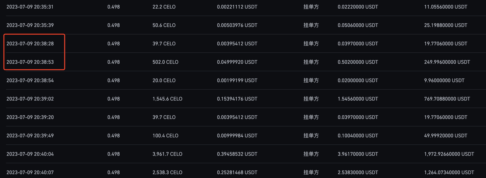
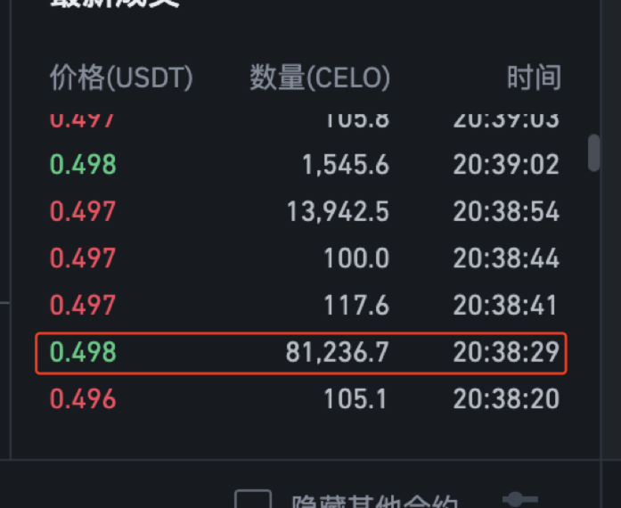
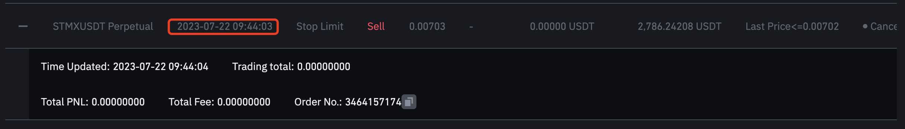
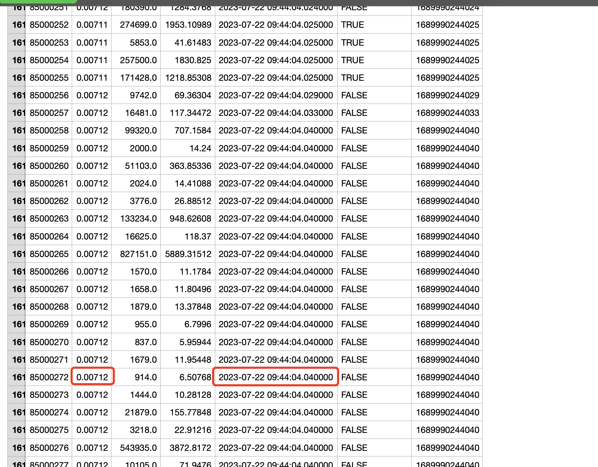
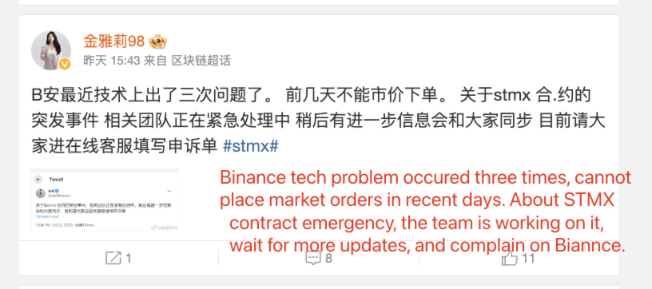
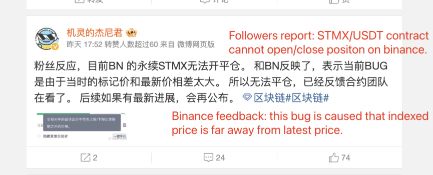
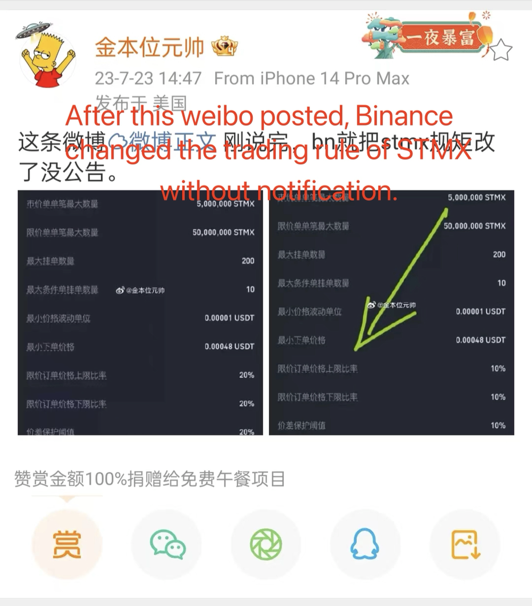
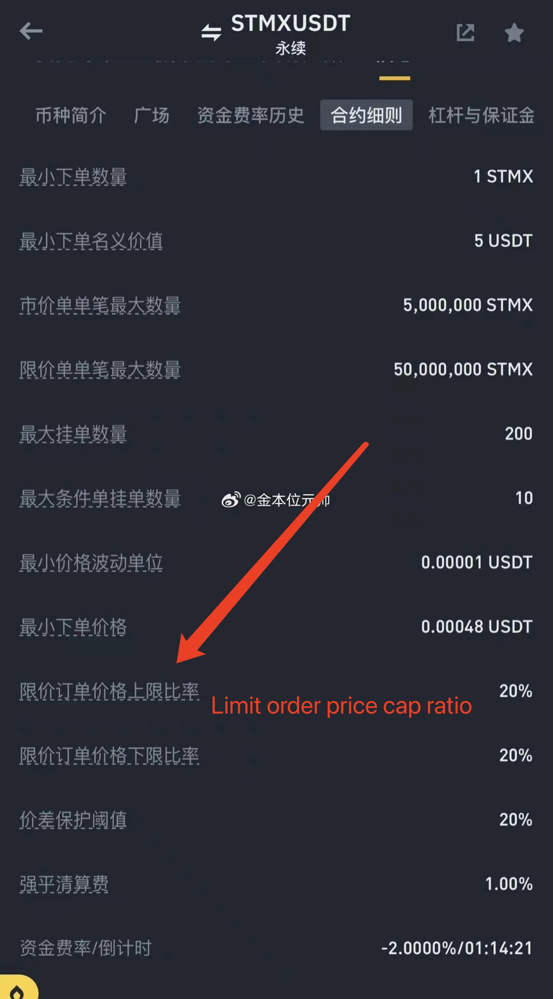
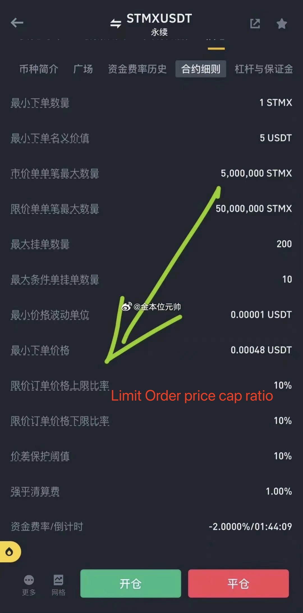

# Binance Fraud Proofs

## 1. Sending Fake Trade Information to Users

### Case #1

As you can see in second picture, Binance send user that there are 81236.7 CELO/USDT buy trade happened at 20:38:29.

Meanwhile, user's maker sell order is placed at before this trade, and user's order was the first at sell 14457.40000000 @ 0.498 due to user's order was traded at 20:38:28, which means, if the Binance claimed 81236.7 did happened, user's order should be filled at 20:38:29, however it did not.

### More Cases will be updated

## 2. Fake Price Fraud

### Case #1

User's order is placed at 09:44:03 which was cancelled after 09:50:00 by user himself due to user's position sufferring magnificent loss in very short time, this user was forced to close this long position at much lower price around 0.55.

At meanwhile, Binance shows that the price was 0.00712 at 09:44:04, which means, user's sell order @ 0.00703 should be filled if those information is true.

And there are more similar orders actions during this period (from 09:44:00 to 09:50:00), and those fake information caused this user suffering 8000 USDT loss. However this user cannot provide those order information due to Binance delete many of user's order history afterwards. According to this user's statement that he is pretty sure that there are 'sell order @ 0.00710' and 'sell order @ 0.00716' was not traded during that time.

### Case #2

## User cannot close positon at current price

From social media: 

## Change Rules without Notifications

### More Cases Reports are Welcomed

If you are suffering loss due to Binance FRAUD as mentioned above, please send more your information and proofment, we will put them togather and report to administrations. 

### Contact: [binancefraud13@gmail.com](mailto:binancefraud13@gmail.com)
